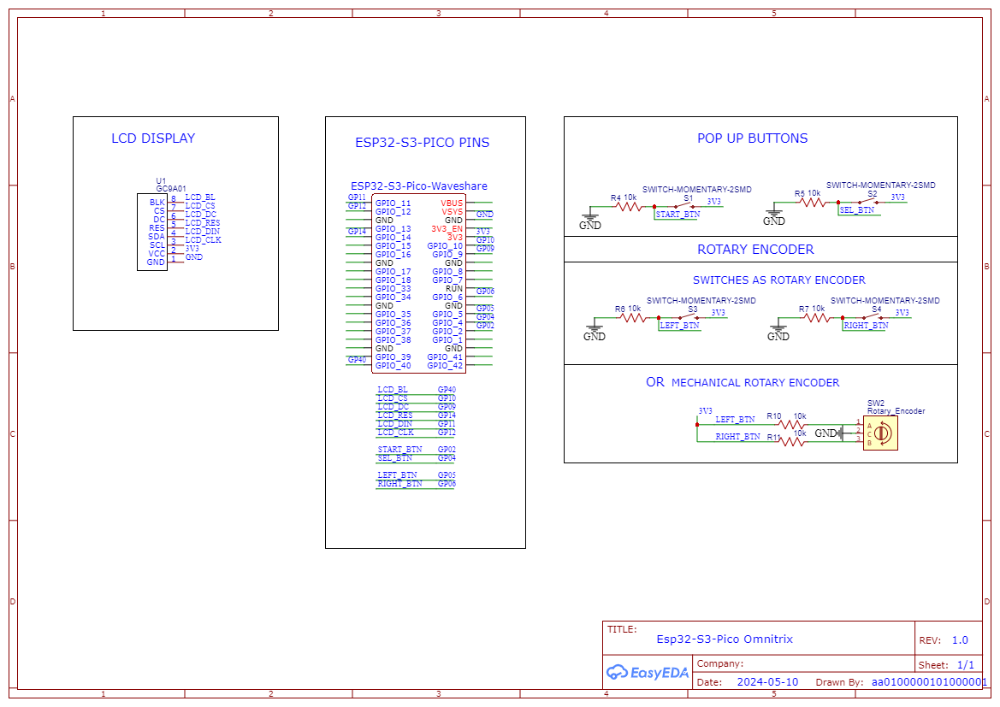

# Omnitrix

# Status
| Ordered the PCB shield I made for [ESP32-S3-LCD-1.28](https://www.waveshare.com/wiki/ESP32-S3-LCD-1.28) and if it works then I'll upload the production files. The Esp32 Dev Board is now set to Esp32-S3-Pico. |
|----|  

# Work in Progress

 


This project is meant to be a replica of the Omnitrix from the Ben 10 Classic series and be as accurate as possible when it comes to operating it like in the series. I started it to learn how to develop a mechatronic project using the ESP32. It started with a ESP32 Development Board - NodeMCU-32S2 module but I found out that there are other boards with an embedded LCD module on the market that are better to use. I decided to use Esp32-S3 LCD 1.28 Inch for now to learn how to make PCBs and rotary encoders in hopes that the size of the final Omnitrix core can be reduced. The software can also be tested with the Esp32-S3-Pico Dev Board that uses the same MCU with Esp32-S3 LCD 1.28 Inch (Esp32-S3R2).   
  
In [Omnitrix-Test-Files](https://github.com/AA0100000101000001/Omnitrix-Test-Files) repository I am documenting varius tests for the features.  
I am also planning to develop an ESP-IDF framework version. See the  [ESP-IDF-Omnitrix-Tests](https://github.com/AA0100000101000001/ESP-IDF-Omnitrix-Tests) repository for testing the features (On hold).  

Video showcasing a first test of the project with most of the features included:  

[](https://www.youtube.com/watch?v=lkjPJR9iCuw) 
  

# Instructions
These are instructions on how to use with a Esp32 Development Board to test the code. Note that the software supports different hardware to test it.     
  
You will need:  
* [Waveshare Esp32-S3-Pico](https://www.waveshare.com/wiki/ESP32-S3-Pico) or any ESP32 Development Board with PSRAM   
* [Round LCD Display GC9A01](https://www.waveshare.com/1.28inch-lcd-module.htm), I am using the [EC Buying](https://www.aliexpress.com/item/1005004786844308.html) one
* [Fermion DFPlayer Pro](https://www.dfrobot.com/product-2232.html)  
* 2X Mini Metal Speaker w/ Wires - 8 ohm 0.5W  
* Rotary Encoder OR 2X MicroSwitch SPDT ON-(ON) - Long Lever 18mm (For the rotary movement, A,B on the Schematic)  
* MicroSwitch SPDT ON-(ON) - Roller Lever (SW on the Schematic)  
* Tact Switch 6x6mm 5mm (ButtonPin on the Schematic)  
* Breadboard, jumper wires, 4X 10 kohm resistor
  
Follow the schematic on how to connect the wires. Some soldering will be needed to connect the pin headers and the speakers to the Fermion DFPlayer Pro. (I have tested the Fermion DFPlayer Pro only with [NodeMCU-32S2 module](https://www.waveshare.com/wiki/NodeMCU-32-S2-Kit) but it possibly works with the Esp32-S3-Pico too)  

## Schematic:  
The goal is to use the Esp32-S3-Pico for the software testing but not all features are tested in it yet. So the old schematic for the Esp32-S2 is still included.  

Old Schematic:  


## Uploading The Software  
This project uses Arduino IDE to program the Esp32 so you need to [install the ESP32 board to it](https://randomnerdtutorials.com/installing-the-esp32-board-in-arduino-ide-windows-instructions/). It also uses Bodmer's [TFT_eSPI](https://github.com/Bodmer/TFT_eSPI) library for the control of the LCD Display and [PNGdec](https://github.com/bitbank2/PNGdec) for displaying png images. You can configure the LCD Display pins by editing the `TFT_eSPI/User_Setup.h` file or you can create a configuration file in `TFT_eSPI/User_Setups` folder and include it in `TFT_eSPI/User_Setup_Select.h` instead of `User_Setup.h`. I have added my configurations in the Supported Displays folder.     
```C
/* TFT_eSPI/User_Setup_Select.h */

//#include <User_Setup.h>           // Default setup is root library folder
//#include <User_Setups/Setup302_ESP32S3_GC9A01_TOUCH.h>
#include <User_Setups/Setup303_ESP32S2_GC9A01.h>
//#include <User_Setups/Setup304_ESP32S3_GC9A01.h>
//#include <User_Setups/Setup305_ESP32S3_LCD128.h>
```
   
You can check the [Omnitrix-Test-Files](https://github.com/AA0100000101000001/Omnitrix-Test-Files/tree/main/Test%20files/Used%20For%20Final%20Project) repository to test the features separately before uploading the code (omnitrix folder) to the MCU. These projects are also helpfull if someone wants to use a different board.  

### User Setup
 Inside the User_Setup folder there are some header files for the pin configuration of non LCD Display parts. You can edit the config_CUSTOM.h file for your own pin configuration or use one of other ones.  
Make sure that the pin configuration file is included in `User_Setup.h`. In this file you can configure hardware and software settings.         
```C
/* User_Setup.h */

//Pin configuration
//Edit User_Setups/config_DEFAULT to create your own configuration 
//or uncomment your preferred configuration
//#include "User_Setups/config_CUSTOM.h" //Use your own configuration
#include "User_Setups/config_ESP32_S2_PINOUT.h"  //Esp32-s2 Dev Board
//#include "User_Setups/config_ESP32_S3_PINOUT.h" //Esp32-s3 Dev Board
```
You can also remove features by commenting the `#define X_ENABLED` definitions. 
#### For hardware settings:   
The only essential features for the software to work are `POP_UP_BUTTONS_ENABLED`, one option for rotary encoder and one option for external wakeup.  
Configuration of external wakeup:  
```C
//WAKEUP SETTINGS: Use ext0 or ext1
//1. Uncomment for use of ext0
#define EXT0_ENABLED
//Choose wakeup pin:
#define EXT0_WAKEUP_PIN GPIO_NUM_5
//Choose wakeup level:
#define EXT0_WAKEUP_MODE 1
//2. Uncomment for use of ext1
//#define EXT1_ENABLED
//Choose bitmap:
//#define EXT1_BITMASK 0x0020 //gpio 5
//Choose mode:
//ESP_EXT1_WAKEUP_ALL_LOW: wake up when all GPIOs go low;
//ESP_EXT1_WAKEUP_ANY_HIGH: wake up if any of the GPIOs go high.
//#define EXT1_WAKEUP_MODE ESP_EXT1_WAKEUP_ANY_HIGH
```
Configuration of pop up buttons and rotary encoder:   
(Magnetic rotary encoder is not supported yet)
```C
//POP UP BUTTONS SETTINGS: Uncomment for buttons
#define POP_UP_BUTTONS_ENABLED

//ROTARY ENCODER SETTINGS: Use one of these options for rotary encoder
//1. Uncomment for use of micro switches for encoder
//#define MICRO_SWITCHES_ROTARY_ENCODER_ENABLED
//2. Uncomment for use of mechanical encoder
#define ROTARY_ENCODER_ENABLED
//3. Uncomment for use of magnetic encoder
//#define MAGNETIC_ROTARY_ENCODER_ENABLED
```
Configuration of sound:  
(Buzzer is not supported yet)
```C
//SOUND SETTINGS: Uncomment for sound
#define SOUND_ENABLED

//SOUND HARDWARE SELECTION: Use one of these options for sound
//1. Uncomment for use of Dfplayer Pro for sound
#define SOUND_DFPLAYER_PRO_ENABLED
//2. Uncomment for use of buzzer for sound
//#define SOUND_BUZZER_ENABLED
```
Configuration of LEDs:  
(They are not supported yet)
```C

//LED SETTINGS: Uncomment for LEDs
//#define LEDS_ENABLED

//LED SELECTION: Use one of these options
//1. Uncomment for RGB LEDS
//#define RGB_LEDS_ENABLED
//LED 2. Uncomment for Neopixel ring LEDs
//#define NEOPIXEL_RING_LEDS_ENABLED
//LED 3. Uncomment for IR controlled LEDs
//#define IR_CONTROLLED_LEDS_ENABLED
```
#### For software settings:  
The only essential setting is one option for the animation. You can configure what kind of animation is being used, if sound will be muted in booting and if demo mode will be enabled (it is not supported right now). 
```C
//SOFTWARE SETTINGS

//Choose only one type of animation
//1. Start animation with images
#define START_ANIMATION_WITH_IMAGES //Has memory leaks
//2. Hard coded start animation
//#define START_ANIMATION_WITHOUT_IMAGES //Not finished

//Choose if sound will be muted in booting
//#define SOUND_MUTED_IN_BOOTING //Only if sound is enabled

//Choose if demo is enabled //not implemented yet
//#define DEMO_ENABLED
//Choose only one type of demo
//1. Demo automated display of the features that can go out of that state when a button is pressed
//#define DEMO_AYTOMATED_ENABLED
//2. Demo user controlled that can go out of that state from the menu
//#define DEMO_CONTROLLED_ENABLED
```

## *Remember to enable PSRAM to avoid Guru Meditation Error*

## Tested With
| Board | Micro Switches as Rotary Encoder | Rotary Encoder | Magnetic Rotary Encoder | DFPlayer_Pro Sound | Buzzer Sound | RGB LEDs Tested | Neopixel Ring |
|----|----|----|----|----|----|----|----| 
| [Waveshare ESP32 Development Board - NodeMCU-32S2 module](https://www.waveshare.com/wiki/NodeMCU-32-S2-Kit) | ✅ | ✅ | | ✅ | | | |
| [Waveshare Esp32-S3-Pico](https://www.waveshare.com/wiki/ESP32-S3-Pico) | | ✅ | | | | | |


## Dependencies
* This project is developed in Arduino IDE version 2.1.1  
* It uses the arduino-esp32 core by Espressif Systems version 2.0.14  
* TFT_eSPI library version 2.5.34  
* PNGdec library version 1.0.1  
* DFRobot_DF1201S library version 1.0.2 

# Current Features:  
* Settings for testing different hardware
* Four states of control (Start mode, Alien Selection mode, Transformation mode, Recharging Mode)
* Support of the first twelve aliens  
* Animation  
* Sound  
* Ability to go into Deep Sleep Mode after a short time of inactivity  
