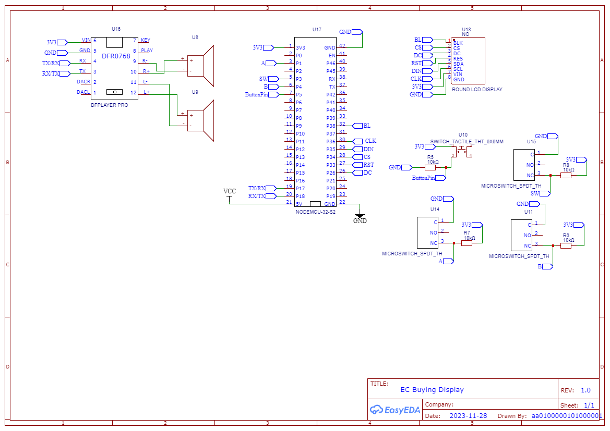

# Omnitrix

# Status
| Found a better board to use. It's [ESP32-S3-LCD-1.28](https://www.waveshare.com/wiki/ESP32-S3-LCD-1.28) and it has a lot of pins usable for peripherals. Planning to add support for that.|
|----|  

# Work in Progress

 

This project is meant to be a replica of the Omnitrix from the Ben 10 Classic series and be as accurate as possible when it comes to using it like in the series. I started it to learn how to develop a mechatronic project using the ESP32. It started with a ESP32 Development Board - NodeMCU-32S2 module but I found out that there are other boards with an intergrated LCD module on the market that are better to use.  

I am also planning to develop an ESP-IDF framework version. See the  [ESP-IDF-Omnitrix-Tests](https://github.com/AA0100000101000001/ESP-IDF-Omnitrix-Tests) repository for testing the features (On hold).  

Video showcasing a first test of the project with most of the features included:  

 

# Instructions
These are instructions on how to use with a Esp32 Development Board to test the code.     
  
You will need:  
* ESP32 Development Board with embedded PSRAM, Currently I have only tested it with [NodeMCU-32S2 module] (https://www.waveshare.com/wiki/NodeMCU-32-S2-Kit)  
* [Waveshare Round LCD Display GC9A01](https://www.waveshare.com/1.28inch-lcd-module.htm), I am using the [EC Buying](https://www.aliexpress.com/item/1005004786844308.html) one but it is not longer available  
* [Fermion DFPlayer Pro] (https://www.dfrobot.com/product-2232.html)  
* 2X Mini Metal Speaker w/ Wires - 8 ohm 0.5W  
* 2X MicroSwitch SPDT ON-(ON) - Long Lever 18mm (A,B on the Schematic)  
* MicroSwitch SPDT ON-(ON) - Roller Lever (SW on the Schematic)  
* Tact Switch 6x6mm 5mm (ButtonPin on the Schematic)  
* Breadboard, jumper wires, 4X 10 kohm resistor
  
Follow the schematic on how to connect the wires. Some soldering will be needed to connect the pin headers and the speakers to the Fermion DFPlayer Pro.  

## Schematic:  

## Uploading The Software  
You can check the [Omnitrix-Test-Files]https://github.com/AA0100000101000001/Omnitrix-Test-Files/tree/main/Test%20files/Used%20For%20Final%20Project) repository to test the features separately before uploading the code (omnitrix folder) to the MCU. These projects are also helpfull if someone wants to use a different board.  
This project uses Arduino IDE to program the Esp32 so you need to [install the ESP32 board to it](https://randomnerdtutorials.com/installing-the-esp32-board-in-arduino-ide-windows-instructions/). Inside the User_Setup folder there are some header files for pin configuration. You can edit the config_CUSTOM.h file for your own configuration or use one of other ones. Make sure that the configuration file is included in the main header. You can also remove features by commenting the `#define X_ENABLED` definitions. BUTTONS_ENABLED is the only essential feature.  
## *Remember to enable PSRAM to avoid Guru Meditation Error*

## Tested With
* [ESP32 Development Board - NodeMCU-32S2 module] (https://www.waveshare.com/wiki/NodeMCU-32-S2-Kit)  

## Support
* This project is developed in Arduino IDE version 2.1.1  
* It uses the arduino-esp32 core by Espressif Systems version 2.0.14  
* TFT_eSPI library version 2.5.34  
* PNGdec library version 1.0.1  
* DFRobot_DF1201S library version 1.0.2 

# Current Features:  
* Four states of control (Start mode, Alien Selection mode, Transformation mode, Recharging Mode)
* Support of the first twelve aliens  
* Animation  
* Sound  
* Ability to go into Deep Sleep Mode after a short time of inactivity  

# To Do List:  
✅ Use Micro switches instead of Encoder  
✅ Power reduction code  
✅ Make Schematic using EasyEDA  
✅ Rewrite code to use GPIO interrupts  
✅ Add config file for pin selection   
☐ Add Default Demo mode   
☐ Check current consumption  
☐ Add support for ESP32-S3 Development Board   
☐ Make PCB for ESP32-S3-LCD-1.28 1.27mm headers to 2.54mm   
☐ Find cheaper component for sound or use passive buzzer  
☐ Make rotary encoder mechanism with micro switches  
☐ RGB LEDs  
☐ Only enable GPIO outputs (LEDs) at the last moment   
☐ Use multiple inputs to wake up from deep sleep (ext1)  
☐ Make PCB that has RGB LEDs, micro switches and speaker for ESP32-S3-LCD-1.28  
☐ Power reduction code for LCD display   
☐ Test LiPo battery with the board  
☐ Reduce size and memory usage of program sketch  
☐ Test operation when all Serial.println are removed  
☐ Create the rest of the mechanisms using a CAD program  
	
# Future Plans:  
☐ Create Omnitrix graphics for GC9A01 driver that uses library commands for animation  
☐ Make PCB for multiple RGB LEDs  
☐ Test current for LED PCB  
☐ Make PCB that has RGB LEDs, micro switches and speaker   
☐ GPIO pins as Vcc for inputs to reduce energy when in Deep Sleep  
☐ Add support for touch lcd  
☐ Add energy system  
☐ Secret combination input for Master Control Mode  
☐ Smoother animation  
☐ Xtra animation  
☐ Download aliens from a server  
☐ Update code with FOTA  
☐ Rechargable battery  
☐ Download additional aliens from a server  
☐ Add motor to elevate display (for fun!)  
☐ Make Omnitrix Microcontroller based on ESP32 chip  
☐ Add Menu that includes:  
* ☐ Time  
* ☐ Battery state  
* ☐ Sound options  
* ☐ Option to turn off LEDs  
* ☐ Options for Changing tranformation Time variables  
* ☐ Low power mode disable/enable (ULP coprossesor use in ESP-IDF)  
* ☐ Demo Mode disable/enable  
* ☐ Search for Updates  
