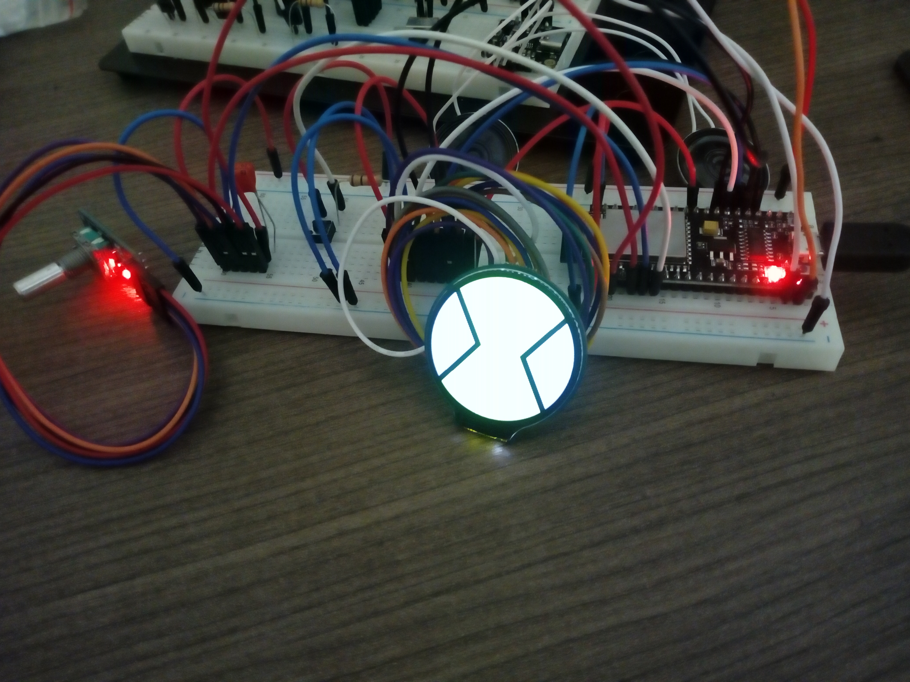
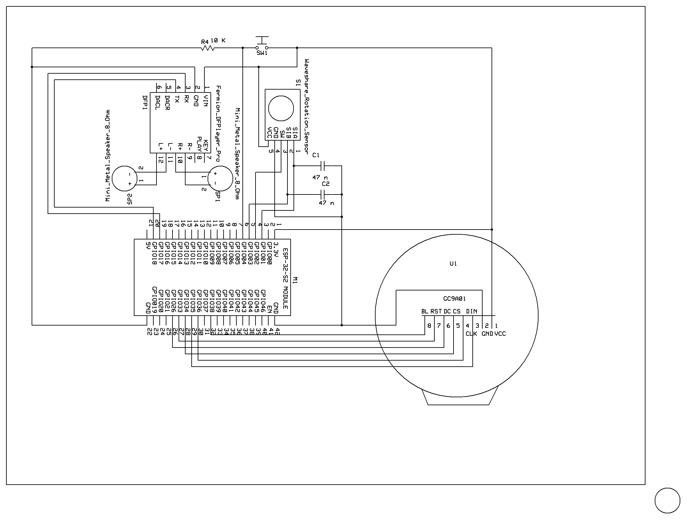

# Omnitrix

# Work in Progress  

 

This project is meant to be a replica of the Omnitrix from the Ben 10 Classic series and be as accurate as posible. It uses a ESP32 Development Board - NodeMCU-32S2 module, a Round LCD Display GC9A01, a Fermion DFPlayer Pro for sound, a Rotary Encoder with Switch and a tact switch for user input.
The Rotary Encoder is planned to be changed by Micro Switches for reducing space. Also RGB LEDs and battery will be added  

Arduino IDE is used for the software part of the project but could be changed for ESP-IDF in order to use the ULP Coprocessor for better power reduction. For the graphics Bodmer's TFT_eSPI library is used and for the sound the DFRobot_DF1201S library.  

Video showcasing a first test of the project with most of the features included:  

https://uniwagr-my.sharepoint.com/:v:/g/personal/ice19390009_uniwa_gr/EfeOqV_51WFMiZ7XlbTfxEgBar_7Mj2zRy3ds0np9BVFCA?e=VAcc18&nav=eyJyZWZlcnJhbEluZm8iOnsicmVmZXJyYWxBcHAiOiJTdHJlYW1XZWJBcHAiLCJyZWZlcnJhbFZpZXciOiJTaGFyZURpYWxvZyIsInJlZmVycmFsQXBwUGxhdGZvcm0iOiJXZWIiLCJyZWZlcnJhbE1vZGUiOiJ2aWV3In19

# Instructions
This is a work in progress and the instructions to recreate this project will change.  
  
For now you will need:  
ESP32 Development Board - NodeMCU-32S2 module,  
Round LCD Display GC9A01,  
Waveshare Rotation Encoder,  
Fermion DFPlayer Pro,  
2X Mini Metal Speaker w/ Wires - 8 ohm 0.5W,  
Breadboard, jumper wires, button, switch, 10 kohm resistor, 2X 47 nF capacitors
  
Follow the schematic on how to connect the wires. Some soldering will be needed to connect the pin headers and the speakers to the Fermion DFPlayer Pro.  
Install ESP32 in Arduino IDE and upload the code (in the omnitrix folder) to the MCU.
*Remember to enable PSRAM to avoid Guru Meditation Error*

# Schematic:  
 

# Current Features:  
- Four states of control (Start mode, Alien Selection mode, Transformation mode, Recharging Mode)
- Array of PNG images decoded into HEX representing the first twelve aliens  
- Animation  
- Sound (commented for now)  
- Ability to go into Deep Sleep Mode after a short time of inactivity  
  

# To Do List:  
☐ Use Micro switches instead of Encoder  
✅ Fixed Guru Meditation Error by delaying tft initialization and changing DC and RST pins  
✅ Fix transformation time in Deep Sleep mode  
✅ Update ShowSelectSymbols and ShowSymbols with PNGdec  
✅ Power reduction code  
☐ Increase resistance of voltage dividers  
☐ Power reduction code and pin rearangement for LCD display  
☐ GPIO pins as Vcc for inputs to reduce energy when in Deep Sleep  
☐ RGB LEDs  
☐ Only enable GPIO outputs (LEDs) at the last moment  
☐ Reduce size and memory usage of program sketch  
☐ Remove all Serial.println  
☐ Conect battery with switch in 5V pin  
☐ Make Schematic using JLCPCB  
☐ Make PCB  
	
# Future Plans:  
☐ Make rotary encoder mechanism with micro switches  
☐ Create the rest of the mechanisms using a CAD program  
☐ Rewrite code to use GPIO interrupts  
☐ Secret combination input for Master Control Mode  
☐ Smoother animation  
☐ Xtra animation  
☐ Update code with FOTA  
☐ Download additional aliens from a server  
☐ Make Omnitrix Microcontroller based on ESP32 chip  
☐ Add Menu that includes:  
- ☐ Time  
- ☐ Battery state  
- ☐ Sound options  
- ☐ Options for Changing tranformation Time variables  
- ☐ Option for a Demo Mode  
- ☐ Search for Updates  
